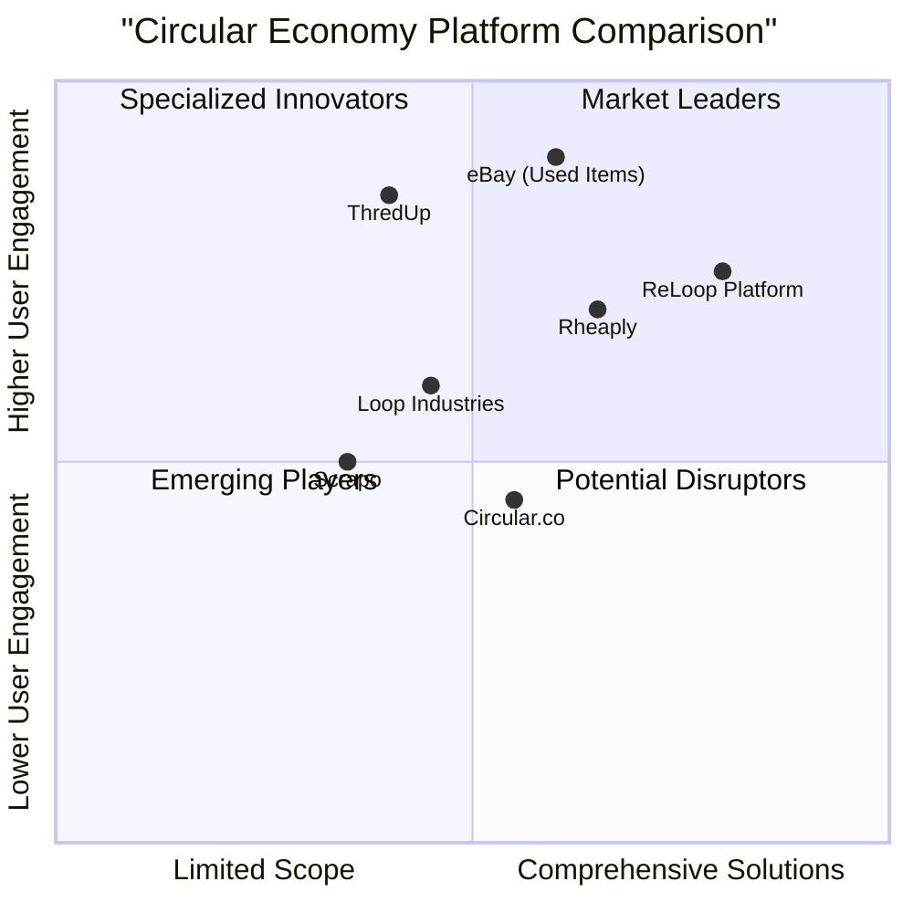

# Genesis: ReLoop Platform PRD

**Product Requirements Document**

**Date:** June 25, 2025
**Version:** 1.0
**Author:** Emma, Product Manager

## Table of Contents

1. [Executive Summary](#executive-summary)
2. [Market Analysis](#market-analysis)
3. [User Personas](#user-personas)
4. [User Journey Maps](#user-journey-maps)
5. [Product Requirements](#product-requirements)
6. [Feature Specifications](#feature-specifications)
7. [UI/UX Requirements](#uiux-requirements)
8. [Content Strategy](#content-strategy)
9. [Technical Requirements](#technical-requirements)
10. [Implementation Roadmap](#implementation-roadmap)
11. [Open Questions](#open-questions)

---

## Executive Summary

Genesis: ReLoop is a comprehensive circular economy platform designed to transform waste into valuable products through an interconnected network of value chains. The platform bridges the gap between waste providers, process operators, and product buyers, creating a sustainable ecosystem for circular economy initiatives.

The platform will consist of three key interconnected components for each of 100+ circular economy value chains: Feedstock Pages (waste source inputs), ChemHub Pages (process chains, transformation methods), and LoopCrafted Product Pages (finished upcycled products). ReLoop will feature a marketplace where users can trade materials and products, with a subscription-based business model that's affordable for startups. The platform incorporates decentralized governance mechanisms to ensure community-driven decision-making and standard setting.

This PRD outlines the market analysis, user personas, feature specifications, UI/UX requirements, content strategy, technical requirements, and implementation roadmap for the Genesis: ReLoop platform.

## Market Analysis

### Market Overview

The global digital circular economy market is valued at approximately $3.56 billion in 2025 and is projected to reach around $25.40 billion by 2034, growing at a CAGR of 24.40%. The broader circular economy market is estimated at $517.79 billion in 2025, with projections to reach $798.3 billion by 2029 at a CAGR of 11.4%.

Growth is driven by:

1. **Rising Environmental Awareness**: Increasing consciousness about climate change and resource depletion
2. **Regulatory Support**: Stricter environmental regulations pushing businesses toward circular economy solutions
3. **Technological Advancements**: IoT, blockchain, and data analytics optimizing resource usage
4. **Supply Chain Resilience**: Businesses seeking circular solutions to enhance resilience against disruptions
5. **Digital Transformation**: Accelerating shift toward digital platforms for product lifecycle management

### Competitive Landscape

#### Key Platform Categories

1. **Product & Material Exchanges**
   - **Rheaply**: B2B asset management and exchange platform
   - **Scrapo**: Marketplace for recycled materials and waste
   - **Circular.co**: Platform for circular initiatives

2. **Reuse & Resale Marketplaces**
   - **ThredUp**: Leading secondhand clothing marketplace with 10.5% year-over-year growth

3. **AI-Driven Platforms**
   - **eBay**: Approximately 40% of gross merchandise value comes from used items

#### Competitive Strategies

1. **Price Competition**: Reducing fees for sellers and brands
2. **AI-Driven Technology Solutions**: Implementing AI to improve user experience
3. **Strategic Partnerships**: Forming alliances with brands and other platforms
4. **Corporate Venture Arms**: Launching investment vehicles to support innovation

### Competitive Quadrant Analysis

**ReLoop's Competitive Advantages**:

1. **Comprehensive Value Chain Integration**: Unlike competitors focusing on specific parts of the circular economy, ReLoop offers end-to-end solutions from waste to finished products
2. **Scientific Process Documentation**: Detailed scientific basis and process guidelines for value chains
3. **Community Node Network**: Physical infrastructure deployment and node self-sufficiency
4. **Integrated Visualization**: 3D globe showing active nodes, live trades, and waste flows
5. **Educational Approach**: Detailed skill requirements and job opportunities for each value chain

## User Personas

### Persona 1: Node Operator

**Name**: Michael Thompson  
**Age**: 42  
**Occupation**: Entrepreneur, Former Manufacturing Manager  

**Background**:  
Michael has 15 years of experience in manufacturing operations and is looking to start a sustainable business in his community. He has access to a small industrial space and some capital to invest.  

**Goals**:  
- Start a profitable and sustainable business  
- Identify viable circular economy opportunities in his area  
- Understand technical requirements and processes  
- Connect with suppliers of waste materials  
- Find markets for finished products  

**Pain Points**:  
- Overwhelmed by technical information  
- Unsure which value chains are most profitable  
- Difficulty finding consistent waste material sources  
- Uncertain about required skills and equipment  
- Limited knowledge of regulatory requirements  

**Needs from Platform**:  
- Clear profitability and ROI information  
- Step-by-step process guides  
- Connection to local waste sources  
- Equipment and skill requirement details  
- Community support and mentorship  

### Persona 2: Waste Provider

**Name**: Sarah Johnson  
**Age**: 35  
**Occupation**: Sustainability Manager at Manufacturing Company  

**Background**:  
Sarah works for a medium-sized manufacturing company that produces significant textile and plastic waste. Her company is committed to sustainability goals and she's tasked with finding circular solutions for their waste streams.  

**Goals**:  
- Reduce waste disposal costs  
- Meet sustainability KPIs for the company  
- Find reliable partners for waste materials  
- Quantify environmental impact of waste diversion  
- Minimize logistics complexity  

**Pain Points**:  
- Unpredictable waste offtake  
- Complex contracts with waste processors  
- Difficult to verify environmental claims  
- Limited visibility into downstream usage  
- Transportation and logistics challenges  

**Needs from Platform**:  
- Simple process to list available waste  
- Verification of partners and processes  
- Environmental impact reporting  
- Streamlined logistics coordination  
- Consistent demand for waste materials  

### Persona 3: Product Buyer

**Name**: David Chen  
**Age**: 29  
**Occupation**: Procurement Specialist at Consumer Goods Company  

**Background**:  
David works in procurement for a consumer goods company that's committed to incorporating recycled and upcycled materials in their products. He's looking for reliable sources of circular materials that meet quality standards.  

**Goals**:  
- Source high-quality recycled materials  
- Ensure consistent supply chain  
- Meet company sustainability targets  
- Find innovative circular materials  
- Manage costs effectively  

**Pain Points**:  
- Inconsistent quality of circular materials  
- Supply chain unpredictability  
- Difficulty verifying sustainability claims  
- Limited access to innovative materials  
- Price volatility  

**Needs from Platform**:  
- Detailed product specifications  
- Quality certification information  
- Reliable supply chain visibility  
- Direct connection to producers  
- Competitive pricing information  

### Persona 4: Circular Economy Professional

**Name**: Elena Rodriguez  
**Age**: 32  
**Occupation**: Chemical Engineer specializing in Bioprocessing  

**Background**:  
Elena is a highly skilled chemical engineer with expertise in bioprocessing. She's passionate about circular economy and wants to apply her skills in transformative projects, either as a consultant or full-time employee at a circular node.  

**Goals**:  
- Find job opportunities in circular economy  
- Apply specialized technical knowledge  
- Connect with innovative projects  
- Continuous learning and skill development  
- Make a positive environmental impact  

**Pain Points**:  
- Limited awareness of job opportunities  
- Difficulty finding roles that match expertise  
- Unclear career development paths  
- Geographical limitations  
- Need for specialized knowledge in multiple domains  

**Needs from Platform**:  
- Job listings specific to circular economy  
- Technical details of processes  
- Connection to node operators  
- Skill development resources  
- Remote work opportunities

## User Journey Maps

### Node Setup Journey

1. **Discovery & Exploration**
   - User visits ReLoop platform
   - Explores featured value chains on landing page
   - Reviews profitability and difficulty ratings
   - Creates account and completes profile

2. **Research & Planning**
   - Researches multiple value chains in detail
   - Uses ChemHub pages to understand processes
   - Reviews equipment and skill requirements
   - Calculates startup costs and potential revenue

3. **Site Selection & Sourcing**
   - Identifies local waste sources through Feedstock pages
   - Connects with potential waste providers
   - Secures physical space for operations
   - Sources equipment and materials

4. **Implementation & Setup**
   - Follows ChemHub process guides for setup
   - Recruits necessary skilled personnel
   - Completes initial production tests
   - Lists node on community map

5. **Operations & Growth**
   - Lists products on LoopCrafted marketplace
   - Establishes ongoing waste supplier relationships
   - Connects with other node operators for knowledge sharing
   - Explores additional value chains to implement

### Feedstock Source Discovery Journey

1. **Initial Search**
   - User identifies waste streams they have access to
   - Searches platform for relevant feedstock types
   - Reviews applicable value chains
   - Evaluates potential revenue from waste

2. **Evaluation**
   - Examines processing requirements for their waste
   - Reviews regional demand for their waste type
   - Checks proximity of nodes accepting their waste
   - Evaluates logistics and transportation options

3. **Connection**
   - Connects with potential node operators
   - Negotiates pricing and supply terms
   - Schedules initial waste transfer
   - Sets up recurring waste collection

4. **Monitoring**
   - Tracks waste diversion metrics
   - Reviews environmental impact data
   - Maintains relationship with node operators
   - Explores additional waste streams to monetize

### Value Chain Implementation Journey

1. **Discovery**
   - User identifies promising value chain
   - Reviews detailed process documentation
   - Examines profitability and market demand
   - Evaluates skill requirements

2. **Knowledge Acquisition**
   - Studies ChemHub process guides in detail
   - Connects with experienced practitioners
   - Completes recommended skill training
   - Sources specialized equipment

3. **Testing & Validation**
   - Conducts small-scale process tests
   - Refines process based on results
   - Validates product quality
   - Optimizes for local conditions

4. **Scaling**
   - Implements full-scale production
   - Lists products on marketplace
   - Establishes stable feedstock supply
   - Integrates with additional value chains

## Product Requirements

### Goals and Objectives

1. **Create a Comprehensive Circular Economy Platform**
   - Develop 100+ interlinking value chain pages
   - Build thriving marketplace for waste and products
   - Establish global community of nodes and operators

2. **Enable Profitable Waste Transformation**
   - Provide clear, actionable process guides
   - Connect waste providers with processors
   - Create marketplace for finished products

3. **Build Self-Sustaining Node Network**
   - Support physical infrastructure deployment
   - Enable node self-sufficiency
   - Facilitate knowledge sharing and trade between nodes

### Requirements Pool

#### P0: Must-Have Requirements

1. **Value Chain Pages**
   - Complete set of 10 featured value chains with detailed Feedstock, ChemHub, and LoopCrafted Product pages
   - Interlinking between related components
   - Clear process descriptions and scientific basis

2. **Landing Page**
   - Showcase 10 animated preview cards for featured value chains
   - Clear call-to-action for exploration
   - Introduction to platform concept

3. **Core Marketplace Features**
   - Listing creation for feedstock and products
   - Search and filtering functionality
   - Secure messaging between users

4. **Basic Community Features**
   - Node registration functionality
   - Simple node location mapping
   - User profiles for individuals and organizations

5. **Mobile-Responsive UI**
   - Functional design across mobile and desktop devices
   - Core glassmorphism UI elements
   - Intuitive navigation structure

#### P1: Should-Have Requirements

1. **Extended Value Chain Library**
   - Additional 45 value chains with complete documentation
   - Advanced search and filtering of value chains
   - User ratings and reviews of value chains

2. **Advanced Marketplace Features**
   - In-platform transaction processing
   - Verification system for sellers and buyers
   - Logistics coordination tools

3. **Enhanced Community Features**
   - 3D globe showing active nodes
   - Basic visualization of trade flows
   - Community forums and knowledge sharing

4. **Analytics Dashboard**
   - Basic metrics for users and nodes
   - Environmental impact tracking
   - Revenue and activity reporting

5. **Content Management System**
   - Tools for adding and updating value chain content
   - User-generated content moderation
   - Educational resource library

#### P2: Nice-to-Have Requirements

1. **Advanced 3D Visualization**
   - Real-time trade visualization
   - Detailed data on material flows between nodes
   - Predictive market analytics

2. **Integrated Subscription Tools**
   - Access controls for premium tools
   - Payment processing for subscriptions
   - Tiered membership model

3. **Mobile Application**
   - Native mobile experience
   - Push notifications for trade opportunities
   - Mobile-optimized process guides

4. **AI-Assisted Recommendations**
   - Personalized value chain suggestions
   - Optimization recommendations for processes
   - Market opportunity alerts

5. **Extended API Integration**
   - Integration with external supply chain systems
   - Open API for third-party developers
   - IoT device connectivity for process monitoring

## Feature Specifications

### Value Chain Pages

#### LoopCrafted Product Page

**Purpose**: Showcase finished upcycled products, their applications, and market value.

**Key Components**:

1. **Product Overview**
   - Product name and description
   - High-quality images/3D renders
   - Key applications and use cases

2. **Market Information**
   - Current market value range
   - Demand trends
   - Certifications and standards

3. **Technical Specifications**
   - Physical and chemical properties
   - Quality parameters
   - Testing methods

4. **Connected Information**
   - Link to source feedstock
   - Link to ChemHub process page
   - Related complementary products

5. **Marketplace Integration**
   - Current marketplace listings
   - Create listing button
   - Market price trends

**Behavior and Interactions**:
- Users can click through to related feedstock and process pages
- Direct buttons to list or purchase product
- Interactive visualization of applications

#### Feedstock Page

**Purpose**: Detail waste source inputs, their availability, and conversion potential.

**Key Components**:

1. **Feedstock Overview**
   - Material name and description
   - Images and visual identification guide
   - Source types and industries

2. **Collection Methods**
   - Recommended collection procedures
   - Processing and preparation guidelines
   - Storage requirements

3. **Availability Information**
   - Common sources and locations
   - Seasonal variations if applicable
   - Quantity estimation guidelines

4. **Connected Information**
   - Links to applicable ChemHub processes
   - Links to resultant products
   - Alternative uses for this feedstock

5. **Marketplace Integration**
   - Current feedstock listings
   - Create listing button
   - Local availability map

**Behavior and Interactions**:
- Interactive map showing sources and processors
- Direct links to processors accepting this feedstock
- Button to list available feedstock

#### ChemHub Page

**Purpose**: Detail the process chain, transformation method, scientific basis, and profitability of conversion processes.

**Key Components**:

1. **Process Overview**
   - Process name and description
   - Visual process flow diagram
   - Quick statistics (difficulty, profitability, sustainability)

2. **Scientific Basis**
   - Detailed explanation of chemical/physical processes
   - Key reactions and transformations
   - References to scientific literature

3. **Implementation Guide**
   - Step-by-step process instructions
   - Equipment requirements and specifications
   - Safety considerations and precautions

4. **Economic Analysis**
   - Startup cost breakdown
   - Operational cost estimates
   - Revenue projections and ROI timeline

5. **Skills and Staffing**
   - Required expertise and certifications
   - Recommended team composition
   - Training resources and links

6. **Connected Information**
   - Links to required feedstock pages
   - Links to resultant product pages
   - Related or complementary processes

**Behavior and Interactions**:
- Interactive process flow diagram with tooltips
- Calculators for cost estimation based on scale
- Links to equipment suppliers and training resources

### Landing Page

**Purpose**: Introduce users to the ReLoop platform and showcase featured value chains.

**Key Components**:

1. **Hero Section**
   - Headline: "ReLoop: Transform Waste into Value"
   - Subtitle: "Join the circular economy revolution with our marketplace of 100+ value chains"
   - Primary CTA: "Explore Value Chains"
   - Secondary CTA: "Join the Community"

2. **Featured Value Chains**
   - 10 animated preview cards for featured chains
   - Each card showing: title, category, image, profitability, sustainability, difficulty
   - View more CTA: "View 55+ More"

3. **How It Works**
   - Step-by-step explanation of platform usage
   - Visual icons for each step
   - Supporting illustrations

4. **Platform Statistics**
   - Number of value chains
   - Number of active nodes
   - Job opportunities
   - Waste streams covered

5. **Success Stories**
   - Testimonials from node operators
   - Before/after case studies
   - Impact metrics and visualizations

**Behavior and Interactions**:
- Animated transition effects for featured cards
- Hover states revealing additional information
- Smooth scrolling between sections

### Community Features

**Purpose**: Build a network of circular economy practitioners and visualize node activities.

**Key Components**:

1. **3D Globe Visualization**
   - Interactive 3D globe showing node locations
   - Visualization of trade flows between nodes
   - Filters for waste types and product categories

2. **Node Profiles**
   - Detailed pages for each community node
   - Active value chains and processes
   - Contact information (if public)
   - Current offerings and needs

3. **Decentralized Governance Mechanism**
   - Token-based voting system for platform decisions
   - Proposal submission system for community improvements
   - Distributed decision-making on value chain protocols and standards
   - Transparency dashboard showing governance activities
   - Multi-tiered governance structure (local nodes, regional hubs, global network)

4. **Node Setup Guide**
   - Step-by-step instructions for establishing a node
   - Resource requirements and considerations
   - Regulatory guidance by region
   - Funding and support options

5. **Community Forum**
   - Discussion boards for specific processes
   - Knowledge sharing and troubleshooting
   - Announcements and updates
   - Regional subcommunities

6. **Event Calendar**
   - Virtual and in-person events
   - Training sessions and webinars
   - Regional meetups
   - Industry conferences

**Behavior and Interactions**:
- Interactive 3D globe with zoom, pan, and selection
- Real-time updates of trade activities where available
- Direct messaging between community members
- Participation in governance votes and proposals

### Marketplace Functionality

**Purpose**: Enable trading of feedstock materials and finished products between platform users.

**Key Components**:

1. **Listing Creation**
   - Structured forms for creating listings
   - Inventory management tools
   - Pricing guidance based on market data
   - Image upload and description fields

2. **Search and Discovery**
   - Advanced filtering by material, location, price
   - Saved searches and alerts
   - Recommended listings based on user profile
   - Map-based search interface

3. **Business Subscription Model**
   - Tiered subscription plans for businesses (Basic, Standard, Premium)
   - Affordable entry-level tier for startups and small businesses
   - Higher tiers with advanced features and higher transaction volumes
   - No commission on transactions, covered by subscription fees
   - Monthly and annual billing options with discounts for annual commitment

4. **Verification System**
   - User ratings and reviews
   - Identity verification process
   - Quality assurance guidelines
   - Dispute resolution process

5. **Logistics Coordination**
   - Shipping and delivery options
   - Integration with logistics providers
   - Tracking and status updates
   - Bulk transaction handling

**Behavior and Interactions**:
- Real-time messaging notifications
- Status tracking for active transactions
- Subscription management dashboard

## UI/UX Requirements

### Design Language

The ReLoop platform will follow the Ramp.com visual language with glassmorphism elements:

1. **Core Visual Elements**
   - **Glassmorphism**: Frosted glass effect with semi-transparent panels and background blur
   - **Minimalist Grid Layout**: Clean, organized structure with ample white space
   - **Sharp Typography**: Clear hierarchical type system with excellent readability
   - **Soft Shadows**: Subtle depth cues without harsh contrasts

2. **Color Palette**
   - **Primary Colors**: Sustainable greens and blues (#0F766E, #0284C7)
   - **Secondary Colors**: Earth tones (#854D0E, #A16207)
   - **Neutral Colors**: Clean grays (#F8FAFC, #E2E8F0, #64748B)
   - **Accent Colors**: Vibrant highlights for important actions (#EC4899, #8B5CF6)

3. **Glassmorphism Implementation**
   - **Transparency**: 70-85% opacity for card elements
   - **Blur Effect**: 10-15px background blur for depth
   - **Border**: 1-2px light borders for definition
   - **Layering**: Multiple z-index layers for dimensional effect

4. **Typography**
   - **Headings**: Inter (Bold/Semi-bold)
   - **Body**: Inter (Regular/Light)
   - **Monospace**: JetBrains Mono for technical specifications
   - **Clear Hierarchy**: Well-defined heading scales (h1-h6)

5. **Interactive Elements**
   - **Buttons**: Rounded with subtle hover animations
   - **Cards**: Glassmorphic panels with hover state enhancements
   - **Form Elements**: Clean, minimal input fields with clear focus states
   - **Transitions**: Smooth, purposeful animations (300-500ms)

### Responsive Design

1. **Mobile-First Approach**
   - **Touch-First UX**: Large touch targets (minimum 44×44px)
   - **Fast-Scroll**: Optimized for vertical scanning
   - **Simplified Views**: Essential information prioritized
   - **Bottom Navigation**: Key functions accessible via thumb zone

2. **Tablet Considerations**
   - **Split Views**: Utilize additional screen space for dual-pane layouts
   - **Enhanced Touch**: Support for more precise interactions
   - **Landscape Optimization**: Adapt layouts for horizontal orientation

3. **Desktop Experience**
   - **Multi-Column Layout**: Utilize larger screens for information density
   - **Advanced Interactions**: Hover states, tooltips, and contextual actions
   - **Keyboard Navigation**: Full support for keyboard shortcuts
   - **Power User Features**: Advanced filtering and batch operations

4. **Responsive Breakpoints**
   - **Mobile**: < 640px
   - **Tablet**: 641px - 1024px
   - **Desktop**: 1025px - 1440px
   - **Large Desktop**: > 1440px

### User Interface Components

1. **Navigation**
   - **Top Navigation**: Main site sections and user account
   - **Sidebar**: Contextual navigation for current section
   - **Breadcrumbs**: Location tracking in deep hierarchies
   - **Search Bar**: Globally accessible search functionality

2. **Cards and Panels**
   - **Value Chain Cards**: Visual previews with key metrics
   - **Information Panels**: Glassmorphic content containers
   - **Action Cards**: Interactive cards with primary functions
   - **Status Cards**: System and process status indicators

3. **Data Visualization**
   - **Process Diagrams**: Flow charts for value chain processes
   - **Market Trends**: Line and bar charts for pricing data
   - **3D Globe**: Interactive visualization of community nodes
   - **Network Graphs**: Relationship maps for connected chains

4. **Form Elements**
   - **Input Fields**: Clean, accessible text inputs
   - **Selection Controls**: Dropdowns, radio buttons, checkboxes
   - **Sliders**: Range selection for filtering
   - **File Uploads**: Drag-and-drop interfaces for images and documents

5. **Feedback Elements**
   - **Notifications**: Transient alerts for system messages
   - **Progress Indicators**: Status tracking for processes
   - **Tooltips**: Contextual help and information
   - **Confirmation Dialogs**: Verification before important actions

## Content Strategy

### Value Chain Content

1. **Content Structure**
   - Consistent template across all value chains
   - Standardized sections for easy comparison
   - Clear technical language with definitions
   - Visual support (diagrams, photos, videos)

2. **Content Requirements**
   - **Scientific Accuracy**: Peer-reviewed process information
   - **Practical Applicability**: Step-by-step guides with real-world considerations
   - **Economic Transparency**: Realistic cost and revenue projections
   - **Technical Completeness**: All required information for implementation

3. **Content Creation Process**
   - Expert review for all process documentation
   - Regular updates based on user feedback
   - Version tracking for process improvements
   - Attribution of sources and research

4. **Visual Content Guidelines**
   - Process flow diagrams for all ChemHub pages
   - Standardized iconography for equipment and materials
   - High-quality imagery for products and feedstocks
   - Video demonstrations for complex processes

### Node Network Content

1. **Node Profile Structure**
   - Standard template for all node profiles
   - Required and optional information fields
   - Verification process for claims
   - Update frequency requirements

2. **Network Visualization Content**
   - Data requirements for globe inclusion
   - Transaction data anonymization standards
   - Aggregate statistics reporting
   - Historical data presentation

3. **Community Guidelines**
   - Code of conduct for community participation
   - Knowledge sharing expectations
   - Content moderation policies
   - Dispute resolution procedures

### Educational Content

1. **Skill Development Resources**
   - Training materials for required skills
   - Certification pathways and resources
   - Expert tutorials and guides
   - Recommended external education

2. **Regulatory Information**
   - Regional compliance guidelines
   - Permitting requirements
   - Safety standards and best practices
   - Environmental regulations

3. **Case Studies**
   - Success stories from existing nodes
   - Implementation challenges and solutions
   - Economic impact examples
   - Environmental benefit calculations

## Technical Requirements

### Frontend Architecture

1. **Technology Stack**
   - **Framework**: Next.js with React
   - **Styling**: Tailwind CSS for utility-first styling
   - **UI Components**: Shadcn UI for consistent design system
   - **3D Visualization**: Three.js for globe and visualization
   - **Animation**: Framer Motion for smooth transitions

2. **Performance Requirements**
   - First Contentful Paint < 1.5s
   - Time to Interactive < 3.5s
   - Smooth 60fps animations
   - Responsive to all input within 100ms

3. **Browser Support**
   - Chrome (latest 2 versions)
   - Firefox (latest 2 versions)
   - Safari (latest 2 versions)
   - Edge (latest 2 versions)
   - Mobile browsers: iOS Safari, Android Chrome

4. **Accessibility Standards**
   - WCAG 2.1 AA compliance
   - Screen reader compatibility
   - Keyboard navigation support
   - Sufficient color contrast ratios

### Backend Architecture

1. **Server Infrastructure**
   - **Hosting**: Cloud-based deployment
   - **Scaling**: Horizontally scalable architecture
   - **Regions**: Multi-region deployment for global audience
   - **CDN**: Content delivery network for static assets

2. **API Design**
   - RESTful API architecture
   - GraphQL for complex data queries
   - OpenAPI/Swagger documentation
   - Rate limiting and request throttling

3. **Authentication & Authorization**
   - OAuth 2.0 / OpenID Connect
   - Role-based access control
   - JWT for session management
   - Two-factor authentication option

4. **Data Storage**
   - PostgreSQL for relational data
   - Redis for caching and real-time features
   - S3-compatible object storage for files and media
   - Analytics data warehouse for reporting

### Data Requirements

1. **Data Models**
   - **Users**: Profiles, preferences, roles
   - **Value Chains**: Feedstock, process, product relationships
   - **Marketplace**: Listings, transactions, ratings
   - **Community**: Nodes, connections, activities

2. **Data Security**
   - Encryption at rest and in transit
   - PII protection and anonymization
   - Regular security audits
   - Data retention policies

3. **Integration Requirements**
   - Payment processor integration
   - Logistics provider APIs
   - Geolocation services
   - Analytics integration

4. **Data Migration**
   - Initial data import plans
   - Ongoing synchronization strategy
   - Backup and recovery procedures
   - Version control for data schemas

### Performance Requirements

1. **Scalability Targets**
   - Support for 10,000+ concurrent users
   - Handle 1,000+ marketplace transactions per hour
   - Store data for 100,000+ value chain nodes
   - Maintain 99.9% uptime

2. **Response Time Goals**
   - API responses < 200ms
   - Search queries < 500ms
   - Page loads < 2s
   - Real-time updates < 100ms

3. **Mobile Performance**
   - Optimized asset delivery
   - Reduced data consumption options
   - Offline-first capabilities where possible
   - Battery-efficient operation

## Implementation Roadmap

### Phase 1: MVP Launch (3 Months)

**Goals**:
- Launch platform with 10 featured value chains
- Establish core marketplace functionality
- Release basic community features

**Deliverables**:
1. **Month 1**:
   - Complete detailed UI/UX design
   - Develop data architecture
   - Build landing page and core navigation

2. **Month 2**:
   - Implement 10 complete value chain sets
   - Develop basic marketplace features
   - Create user account system

3. **Month 3**:
   - Implement simple node mapping
   - Complete testing and bug fixes
   - Launch MVP version

### Phase 2: Community Expansion (6 Months)

**Goals**:
- Expand to 55 value chains
- Enhance marketplace features
- Develop initial 3D visualization

**Deliverables**:
1. **Months 1-2**:
   - Research and develop additional 20 value chains
   - Implement transaction processing system
   - Develop user verification system

2. **Months 3-4**:
   - Research and develop additional 25 value chains
   - Implement basic 3D globe visualization
   - Build community forum features

3. **Months 5-6**:
   - Implement analytics dashboard
   - Develop content management system
   - Launch advanced search and filtering

### Phase 3: Full Scale Platform (6 Months)

**Goals**:
- Complete 100+ value chain library
- Implement advanced visualization
- Add advanced features and optimizations

**Deliverables**:
1. **Months 1-2**:
   - Research and develop remaining value chains
   - Implement real-time trade visualization
   - Develop subscription tools

2. **Months 3-4**:
   - Implement AI recommendation system
   - Develop API for third-party integration
   - Create mobile optimization

3. **Months 5-6**:
   - Implement IoT connectivity
   - Perform platform-wide optimizations
   - Launch full features platform

## Open Questions

1. **Regulatory Compliance**
   - How will the platform address varying regulatory requirements across different regions?
   - What level of certification verification will be required for marketplace participants?

2. **Sustainability Metrics**
   - How will environmental impact be measured and verified?
   - Should carbon footprint calculations be incorporated into the platform?

3. **Economic Model**
   - Is the tiered subscription model sufficiently affordable for startups while still supporting platform operations?
   - How should the platform integrate future revenue streams from agents?
   - What metrics should be used to evaluate subscription tier effectiveness?

4. **Quality Control**
   - How will the platform ensure quality of products traded?
   - What mechanisms will prevent misuse or fraudulent listings?

5. **Scale Limitations**
   - How will the platform facilitate value chains that are only economically viable at large scale?
   - What support systems can help smaller operators overcome scale challenges?

6. **Community Governance**
   - How should voting power be distributed within the decentralized governance system?
   - What safeguards should be implemented to prevent governance capture?
   - How will the platform balance decentralized decision-making with operational efficiency?

7. **Integration Priorities**
   - Which external systems should be prioritized for API integration?
   - How deep should integration capabilities be developed in the initial phases?
